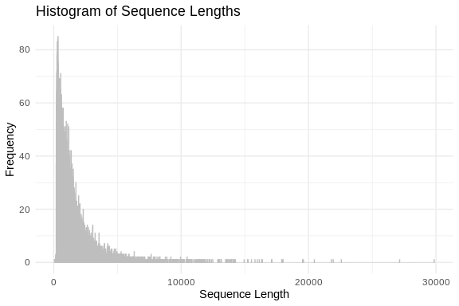
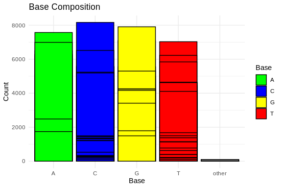
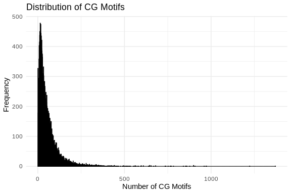

# Oh What a Blast!
Steven Roberts
2023-12-26

Blasting SeaStar sequences against Swiss-Prot UniProt

# Download Swiss-Prot

Need to see what release so to name correctly


Naming `uniprot_sprot_r2023_05`

``` bash
cd ../data
curl -O https://ftp.uniprot.org/pub/databases/uniprot/current_release/knowledgebase/complete/uniprot_sprot.fasta.gz
mv uniprot_sprot.fasta.gz uniprot_sprot_r2023_05.fasta.gz
gunzip -k uniprot_sprot_r2023_05.fasta.gz
```

Will make blasdb directory that will git ignore…

``` bash
mkdir ../blastdb
/home/shared/ncbi-blast-2.15.0+/bin/makeblastdb \
-in ../data/uniprot_sprot_r2023_05.fasta \
-dbtype prot \
-out ../blastdb/uniprot_sprot_r2023_05
```

# Lets look a query

``` bash
head ../data/augustus.hints.codingseq
```

    >g3450.t1
    ATGAACTACCGGACTGATGATGAAATATATGAAGATGAGGTGGACGAGGAGACAAAACTG
    CATCACAGAATTGATGAGCGTGGAGTGAACGGAACTGATTCTCGAGATGAACCAACAAGA
    GTTCCTCCAGCCAAGCAGCTGAAGATTCAAGCACCAGTATTGGCGTCTCGGCTCCAGCTG
    GAAGCAGTGAGGCGGCCCCACCCCCCTCCTCTTCATCCTCCTCAGATCCACCTGTACCTA
    GAACCACACCTAGAGGCATTACAACAGCGTTGTGATAGCTACAAAGGCATTGTTGGATAA
    >g3451.t1
    ATGAAGATCAACAAAGAAAAATCCAAAGTGATGCATTTGTCTCGCTGCAAAACACCCACG
    GACGAGCATCTTCCACATTACACACTGCAAGAGACACAGAGCAAACTGTTCTGCAGACTG
    AAGGGGCTGAGAGATTACAACTTTCGCAGTTTCATTCTGGCCTTTCTGCAGTACAATCCA

``` bash
echo "How many sequences are there?"
grep -c ">" ../data/augustus.hints.codingseq
```

    How many sequences are there?
    26581

``` r
# Read FASTA file
fasta_file <- "../data/augustus.hints.codingseq"  # Replace with the name of your FASTA file
sequences <- readDNAStringSet(fasta_file)

# Calculate sequence lengths
sequence_lengths <- width(sequences)

# Create a data frame
sequence_lengths_df <- data.frame(Length = sequence_lengths)

# Plot histogram using ggplot2
ggplot(sequence_lengths_df, aes(x = Length)) +
  geom_histogram(binwidth = 1, color = "grey", fill = "blue", alpha = 0.75) +
  labs(title = "Histogram of Sequence Lengths",
       x = "Sequence Length",
       y = "Frequency") +
  theme_minimal()
```



``` r
# Read FASTA file
fasta_file <- "../data/augustus.hints.codingseq"
sequences <- readDNAStringSet(fasta_file)

# Calculate base composition
base_composition <- alphabetFrequency(sequences, baseOnly = TRUE)

# Convert to data frame and reshape for ggplot2
base_composition_df <- as.data.frame(base_composition)
base_composition_df$ID <- rownames(base_composition_df)
base_composition_melted <- reshape2::melt(base_composition_df, id.vars = "ID", variable.name = "Base", value.name = "Count")

# Plot base composition bar chart using ggplot2
ggplot(base_composition_melted, aes(x = Base, y = Count, fill = Base)) +
  geom_bar(stat = "identity", position = "dodge", color = "black") +
  labs(title = "Base Composition",
       x = "Base",
       y = "Count") +
  theme_minimal() +
  scale_fill_manual(values = c("A" = "green", "C" = "blue", "G" = "yellow", "T" = "red"))
```



``` r
# Read FASTA file
fasta_file <- "../data/augustus.hints.codingseq"
sequences <- readDNAStringSet(fasta_file)

# Count CG motifs in each sequence
count_cg_motifs <- function(sequence) {
  cg_motif <- "CG"
  return(length(gregexpr(cg_motif, sequence, fixed = TRUE)[[1]]))
}

cg_motifs_counts <- sapply(sequences, count_cg_motifs)

# Create a data frame
cg_motifs_counts_df <- data.frame(CG_Count = cg_motifs_counts)

# Plot CG motifs distribution using ggplot2
ggplot(cg_motifs_counts_df, aes(x = CG_Count)) +
  geom_histogram(binwidth = 1, color = "black", fill = "blue", alpha = 0.75) +
  labs(title = "Distribution of CG Motifs",
       x = "Number of CG Motifs",
       y = "Frequency") +
  theme_minimal()
```



# Running Blastx

``` bash
/home/shared/ncbi-blast-2.15.0+/bin/blastx \
-query ../data/augustus.hints.codingseq \
-db ../blastdb/uniprot_sprot_r2023_05 \
-out ../analyses/11-sr_blast/Pyc_coding_blastx_sp.tab \
-evalue 1E-20 \
-num_threads 40 \
-max_target_seqs 1 \
-outfmt 6
```

``` bash
head -2 ../analyses/11-sr_blast/Pyc_coding_blastx_sp.tab

echo "Number of lines in output"
wc -l ../analyses/11-sr_blast/Pyc_coding_blastx_sp.tab
```

    g3452.t1    sp|Q9Y6A2|CP46A_HUMAN   36.842  380 201 6   73  1119    16  387 6.36e-73    238
    g3453.t1    sp|Q9Y6A2|CP46A_HUMAN   39.574  470 267 7   79  1470    20  478 2.81e-111   342
    Number of lines in output
    473 ../analyses/11-sr_blast/Pyc_coding_blastx_sp.tab

# Joining Blast table with Annotations

## prepping for easy join

``` bash
tr '|' '\t' < ../analyses/11-sr_blast/Pyc_coding_blastx_sp.tab \
> ../analyses/11-sr_blast/Pyc_coding_blastx_sp_sep.tab

head -1 ../analyses/11-sr_blast/Pyc_coding_blastx_sp_sep.tab
```

From here there are a couple of ways to go - can use full annoation
table from Uniprot.. or just grab annotation based on UniProt Acesssion…
the latter can be done using web or Python API.
